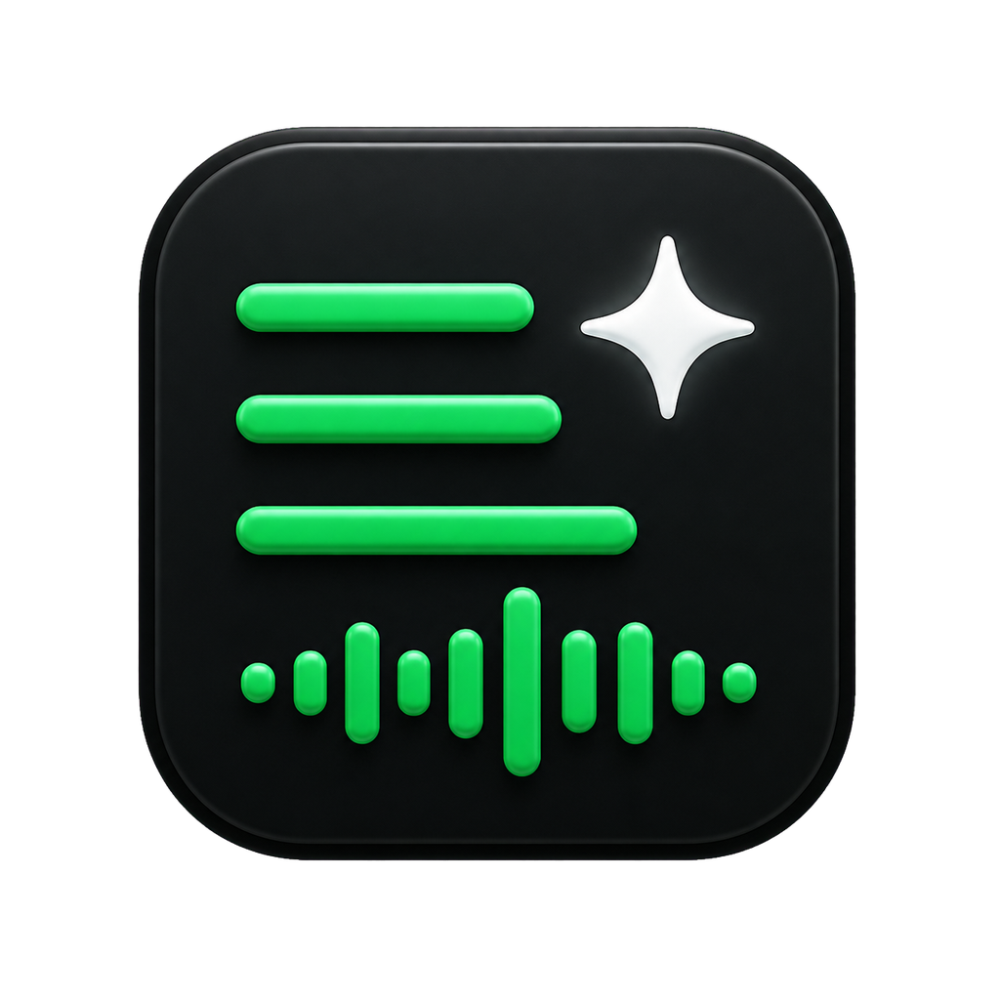

<p align="center">
  
</p>

<h1 align="center">PlaylistAI</h1>

<p align="center">
  An AI-powered Spotify playlist curator.<br>
  Describe an idea and get a playlist verified against Spotify's real catalog.
</p>

<p align="center">
  
  
  
  <a href="README.md"></a>
  <a href="LICENSE"></a>
</p>

<p align="center">
  Created by <a href="https://github.com/kerwilgil"><strong>Kerwil Gil</strong></a>
  · <a href="README.md">Leer en español</a>
</p>

<p align="center">
  <a href="https://github.com/kerwilgil/PlaylistAI/releases/tag/v1.0.0"><strong>Download PlaylistAI 1.0.0</strong></a>
</p>

## Download

- **Windows 10/11 (x64):** download
  [`PlaylistAI-1.0.0-Windows-x64.zip`](https://github.com/kerwilgil/PlaylistAI/releases/download/v1.0.0/PlaylistAI-1.0.0-Windows-x64.zip),
  extract the folder, and open `PlaylistAI.exe`.
- **macOS:** download the source code from
  [release 1.0.0](https://github.com/kerwilgil/PlaylistAI/releases/tag/v1.0.0)
  and build `PlaylistAI.app` on the Mac with `bash scripts/build_macos.sh`.

PlaylistAI runs locally on `127.0.0.1:5000`. Your credentials remain in the
`.env` file on your computer and are never embedded in the executable.

## Features

- **Create with AI:** describe a mood or concept and the desired track count.
  PlaylistAI creates the playlist in Spotify with live verification progress.
- **Analyze playlists:** paste a Spotify playlist link and receive suggestions
  for tracks to remove or add.
- **Two AI access modes:** use a local Claude Code or Codex subscription, or an
  Anthropic, OpenAI, or NVIDIA NIM API key.
- **Adaptive theme:** System (default), Dark, or Light, with a persistent browser
  preference.

## How playlist creation works

1. The selected AI proposes tracks that match your concept.
2. Each suggestion is searched in Spotify and the artist identity is verified.
3. If the AI suggests a title that does not exist, PlaylistAI may use a real,
   popular track from the same artist and mark it as a substitute.
4. The playlist is created only with tracks verified against Spotify's catalog.

## Local setup

1. Open the [Spotify Developer Dashboard](https://developer.spotify.com/dashboard)
   and create an application.
2. Add this exact URL under `Settings -> Redirect URIs`:

   ```text
   http://127.0.0.1:5000/callback
   ```

3. If your Spotify application is in Development Mode, add your Spotify account
   under `Settings -> User Management`.
4. Configure `.env` from `.env.example`:

   ```text
   SPOTIFY_CLIENT_ID=your_client_id
   SPOTIFY_CLIENT_SECRET=your_client_secret
   SPOTIFY_REDIRECT_URI=http://127.0.0.1:5000/callback

   ANTHROPIC_API_KEY=your_anthropic_key
   OPENAI_API_KEY=
   NVIDIA_API_KEY=
   ```

   Spotify credentials are always required. For AI access, configure one API
   key or use a compatible local subscription.

### Use Claude Code or Codex without an AI API key

1. Install the relevant CLI and authenticate it from a terminal:

   ```text
   claude
   codex login
   ```

2. Open *AI Configuration → Local subscription*.
3. Select **Claude Code** or **Codex**, choose a model, and save.

PlaylistAI uses the existing local login without reading or storing account
details. Each request runs without tools or session persistence; Codex runs
read-only in a temporary directory. API-key environment variables are removed
from the child process to prevent accidental API billing. Usage remains subject
to the availability and limits of the plan associated with each CLI.

## Run from source

Windows PowerShell:

```powershell
.\start.ps1
```

Windows double-click launcher: `start.cmd`.

macOS double-click launcher: `start.command`.

Bash:

```bash
bash start.sh
```

Then open <http://127.0.0.1:5000> and connect your Spotify account.

If [`uv`](https://docs.astral.sh/uv/) is installed, the launchers use it to
resolve dependencies automatically. Otherwise, they create a local `.venv`,
install `requirements.txt`, and run `python app.py`.

## Desktop builds

Desktop builds remain fully local and bind only to `127.0.0.1:5000`. They run
silently in the background without a console or floating window.

Build the Windows executable with:

```powershell
.\scripts\build_windows.ps1
```

The result is `dist\windows\PlaylistAI.exe`.

Build the macOS application on a Mac with:

```bash
bash scripts/build_macos.sh
```

The results are `dist/macos/PlaylistAI.app` and
`dist/macos/PlaylistAI-macOS.zip`. Public distribution without Gatekeeper
warnings requires an Apple Developer ID certificate and notarization.

## Models and access modes

Local subscription mode defaults to each CLI's automatic model selection and
also allows a compatible family to be selected explicitly. API mode keeps each
provider's model catalog. The settings page filters providers by access mode and
checks that the selected CLI session or API key is available.

## Troubleshooting

- **Login returns to the home screen:** verify the Spotify credentials, redirect
  URI, and Development Mode user list.
- **Spotify error 429:** wait before retrying; Spotify has temporarily
  rate-limited your application.
- **Error 403 while editing:** log out, reconnect, and accept the playlist
  modification permissions.
- **Claude Code or Codex is unavailable:** run `claude auth status` or
  `codex login status` in a terminal, authenticate, and restart PlaylistAI.

## Security

The `.env` file is ignored by Git and is never uploaded to the repository.
PlaylistAI binds only to loopback and is not exposed to the Internet or LAN.

See [`CONTEXT.md`](CONTEXT.md) for security audit history and implementation
details.

## Creator

PlaylistAI was created and is maintained by
[Kerwil Gil](https://github.com/kerwilgil).

## License

PlaylistAI is distributed under the [MIT License](LICENSE).

Copyright © 2026 Kerwil Gil.
