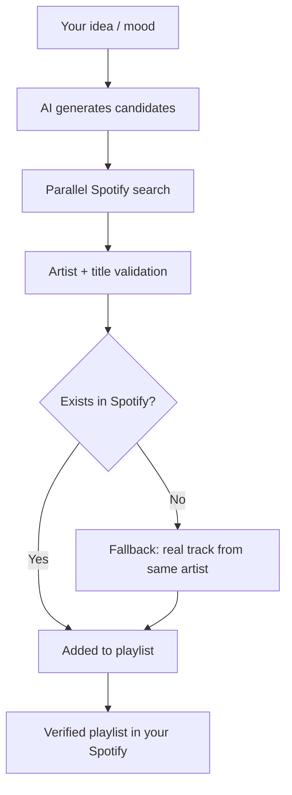

<p align="center">
  
</p>

<h1 align="center">PlaylistAI</h1>

<p align="center">
  AI-powered Spotify playlist creation and analysis.<br>
  Describe a mood, idea or concept and get a real Spotify playlist with verified tracks.
</p>

<p align="center">
  
  
  
  
  
  <a href="LICENSE"></a>
  
</p>

<p align="center">
  <a href="https://github.com/kerwilgil/PlaylistAI/releases/tag/v1.1.0"><strong>Download PlaylistAI 1.1.0</strong></a>
</p>

<p align="center">
  Created by <a href="https://github.com/kerwilgil"><strong>Kerwil Gil</strong></a>
  · <a href="README.md">Leer en español</a>
</p>

---

## Why PlaylistAI?

- 🎵 **AI playlist generation** — describe a mood, genre, activity or concept and the app creates the playlist in your Spotify.
- ✅ **Real Spotify catalog verification** — every suggested track is searched and validated against Spotify's actual catalog with strict artist matching.
- 🤖 **Multiple AI providers** — Claude (Anthropic), OpenAI, NVIDIA NIM via API; Claude Code and Codex via local subscription.
- 🔍 **Existing playlist analysis** — paste a link and get suggestions on what to remove, keep, or add.
- ⚡ **Parallel track verification** — concurrent searches to speed up large playlist creation.
- 💻 **Local-first** — runs on your machine (`127.0.0.1:5000`); credentials in `.env`, never bundled.
- 🪟 **Native Windows support** — single-file `.exe` built with PyInstaller.
- 🍎 **Native macOS support** — ad-hoc signed `.app` for local use; Apple Silicon prebuilt binary available.

---

## Quick Start

### Download

| Platform | Link |
|----------|------|
| **Windows 10/11 (x64)** | [`PlaylistAI-1.1.0-Windows-x64.zip`](https://github.com/kerwilgil/PlaylistAI/releases/download/v1.1.0/PlaylistAI-1.1.0-Windows-x64.zip) — extract and run `PlaylistAI.exe` |
| **macOS (Apple Silicon)** | [`PlaylistAI-1.1.0-macOS-arm64.zip`](https://github.com/kerwilgil/PlaylistAI/releases/download/v1.1.0/PlaylistAI-1.1.0-macOS-arm64.zip) — unzip, move `PlaylistAI.app` to *Applications*; first launch: right-click → **Open** (ad-hoc signed, not notarized) |
| **macOS (Intel) or build yourself** | Download source from [release 1.1.0](https://github.com/kerwilgil/PlaylistAI/releases/tag/v1.1.0) and build with `bash scripts/build_macos.sh` |
| **Source code** | `git clone https://github.com/kerwilgil/PlaylistAI.git` |

> The app runs at `http://127.0.0.1:5000`. Credentials stay in `.env` next to the executable (Windows) or in `~/Library/Application Support/PlaylistAI/.env` (macOS). **Never** embedded in the binary.

### Run from source

```bash
git clone https://github.com/kerwilgil/PlaylistAI.git
cd PlaylistAI
```

**Windows PowerShell:**
```powershell
.\start.ps1
```

**Windows (double-click):**
```
start.cmd
```

**macOS (double-click):**
```
start.command
```

**bash / Linux / WSL:**
```bash
bash start.sh
```

Then open <http://127.0.0.1:5000> and connect your Spotify account.

> If you have [`uv`](https://docs.astral.sh/uv/) installed, launchers use it to resolve dependencies automatically. Otherwise, they create a `.venv`, install `requirements.txt` with `pip`, and run `python app.py`.

---

## How it works (playlist creation)



1. **AI proposes candidates** — based on your description, requests an optimized batch of tracks.
2. **Parallel Spotify search** — each suggestion searched concurrently (max 5 workers).
3. **Strict validation** — requires real artist match (not just title).
4. **Smart fallback** — if title doesn't exist, uses a popular real track from the same artist (marked as *substitute*).
5. **Incremental rounds** — if tracks are missing, AI requests new batches avoiding anything already attempted, until target is reached or round/time limits hit.
6. **Final creation** — playlist created in Spotify only with verified tracks.

---

## Features

### Playlist creation
- Natural language generation (mood, genre, activity, concept)
- Live progress: "Verifying 12/30…"
- Strict artist verification against real Spotify catalog
- Automatic fallback to real tracks from the same artist
- Hard constraint enforcement: *instrumental/no vocals*, *no remixes*, *no live versions*
- Adaptive rounds with dynamic oversampling (1.4×) and max 12 rounds

### Playlist analysis
- Paste any Spotify playlist link
- AI evaluates track coherence with the concept
- Suggests up to 3 tracks to remove (with reason)
- Suggests 8 new tracks to add (with reason)
- Brief analysis summary

### AI providers
| Mode | Providers | Featured models |
|------|-----------|-----------------|
| **API** | Anthropic, OpenAI, NVIDIA NIM | Claude Sonnet 5, GPT-5.6 Terra, DeepSeek V4 Pro |
| **Local subscription** | Claude Code, Codex | Automatic (CLI config), Sonnet/Opus/Haiku, GPT-5.6 |

> In local subscription mode, PlaylistAI uses your already-authenticated CLI session. It never reads or stores account credentials. Runs CLIs without tools, without persistence, and (Codex) in read-only sandbox.

### Spotify verification
- Parallel search (ThreadPoolExecutor, 5 workers)
- Token-overlap matching on normalized text (ignores accents, parentheses, punctuation)
- Combined name+artist score (0.65/0.35) when artist provided; name+popularity (0.9/0.1) without
- In-memory cache (500 entries) to avoid duplicate calls
- Search API limits respected (`limit=10` in Development Mode)

### Desktop support
- **Windows**: standalone `.exe` via `scripts/build_windows.ps1` → `dist/windows/PlaylistAI.exe`
- **macOS**: `.app` + `.zip` via `scripts/build_macos.sh` → `dist/macos/PlaylistAI.app`
- Silent background execution, single-instance, auto-opens browser
- Native icon (`.ico` / `.icns` from `assets/playlistai-icon.png` 1024×1024)

### Privacy / Local-first
- Only connects to: Spotify Web API, selected AI provider (API or local CLI)
- `.env` in `.gitignore` — never committed
- Exclusive bind to `127.0.0.1:5000` (loopback)
- No telemetry, no analytics, no user accounts

---

## Tech Stack

- **Python** 3.12+
- **Flask** 3.1.3+ (monolithic backend, SSR + NDJSON streaming)
- **Spotipy** 2.26.0+ (Spotify Web API client)
- **Requests** 2.34.2+ (HTTP calls to AI APIs)
- **PyInstaller** 6.21 (desktop builds)
- **HTML / CSS / JavaScript** vanilla (frontend in `templates/index.html`)
- **AI APIs**: Anthropic (Messages), OpenAI (Responses/Chat), NVIDIA NIM (Chat Completions)
- **Local AI**: Claude Code CLI, Codex CLI (non-interactive processes)

---

## Local setup (detailed)

1. Create an app at <https://developer.spotify.com/dashboard>
2. In **Settings → Redirect URIs** add **exactly**:
   ```
   http://127.0.0.1:5000/callback
   ```
   (Do not use `localhost` or `oauth.pstmn.io`)
3. **Development Mode**: in **Settings → User Management** add your Spotify account (email/username). Without this, login fails.
4. Copy `.env.example` to `.env` and fill in:
   ```env
   SPOTIFY_CLIENT_ID=your_client_id
   SPOTIFY_CLIENT_SECRET=your_client_secret
   SPOTIFY_REDIRECT_URI=http://127.0.0.1:5000/callback

   ANTHROPIC_API_KEY=your_anthropic_key
   OPENAI_API_KEY=
   NVIDIA_API_KEY=
   ```
   - Spotify credentials **always required**.
   - For AI: configure **one** API key **or** use local subscription (see below).

### Use Claude Code or Codex without an AI API key

1. Install and authenticate the CLI:
   ```bash
   claude              # Claude Code
   codex login         # Codex
   ```
2. In the app: *AI Configuration → Local subscription*
3. Select **Claude Code** or **Codex**, choose a model, and save.

---

## Screenshots

> Coming soon. The app icon is available at `assets/playlistai-icon.png`.

---

## Contributing

PlaylistAI is open source under the MIT license. Contributions welcome:

1. Fork the repo
2. Create a branch: `git checkout -b feature/my-improvement`
3. Commit your changes
4. Open a Pull Request

For bugs or feature proposals, open an *Issue*.

---

## Security

- `.env` ignored by Git — never uploaded to the repository
- OAuth with `state` (CSRF protection) and `MemoryCacheHandler` (no token on disk)
- Security headers: `X-Content-Type-Options`, `X-Frame-Options: DENY`, `Content-Security-Policy: frame-ancestors 'none'`, `Referrer-Policy: same-origin`
- Exclusive bind to loopback (`127.0.0.1:5000`)
- See [`CONTEXT.md`](CONTEXT.md) for audit history and known gotchas

---

## Accessibility

- Form labels correctly linked (`for=`/`id`)
- Muted text (`--text-muted`) meets WCAG AA contrast (~4.6:1)
- Adaptive theme: System (respects `prefers-color-scheme`), Dark, Light

---

## Responsive

- **Desktop** (≥1180px): full layout with 240px sidebar
- **Tablets / 13" laptops** (≤1180px): 208px sidebar, 20px touch targets
- **Mobile** (≤768px): sticky top bar (logo + account) + fixed bottom nav bar (4 sections)

---

## Creator

PlaylistAI was created and is maintained by
[Kerwil Gil](https://github.com/kerwilgil).

---

## License

PlaylistAI is distributed under the [MIT License](LICENSE).

Copyright © 2026 Kerwil Gil.

---

If PlaylistAI is useful to you, consider giving the repository a ⭐.