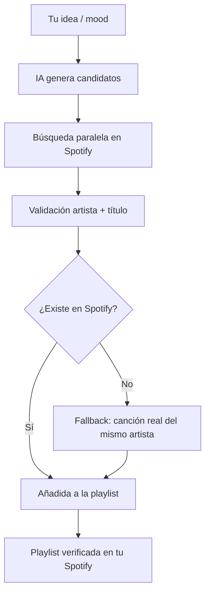

<p align="center">
  
</p>

<h1 align="center">PlaylistAI</h1>

<p align="center">
  AI-powered Spotify playlist creation and analysis.<br>
  Describe a mood, idea or concept and get a real Spotify playlist with verified tracks.
</p>

<p align="center">
  
  
  
  
  
  <a href="LICENSE"></a>
  
</p>

<p align="center">
  <a href="https://github.com/kerwilgil/PlaylistAI/releases/tag/v1.1.0"><strong>Descargar PlaylistAI 1.1.0</strong></a>
</p>

<p align="center">
  Creado por <a href="https://github.com/kerwilgil"><strong>Kerwil Gil</strong></a>
  · <a href="README.en.md">Read in English</a>
</p>

---

## ¿Por qué PlaylistAI?

- 🎵 **Generación de playlists con IA** — describe un mood, género, actividad o concepto y la app crea la playlist en tu Spotify.
- ✅ **Verificación real contra el catálogo de Spotify** — cada canción sugerida se busca y valida que el artista coincida de verdad.
- 🤖 **Múltiples proveedores de IA** — Claude (Anthropic), OpenAI, NVIDIA NIM por API; Claude Code y Codex mediante suscripción local.
- 🔍 **Análisis de playlists existentes** — pega un link y recibe sugerencias de qué quitar, qué mantener y qué añadir.
- ⚡ **Verificación en paralelo** — búsquedas concurrentes para acelerar la creación de listas grandes.
- 💻 **Local-first** — se ejecuta en tu equipo (`127.0.0.1:5000`); credenciales en `.env`, nunca empaquetadas.
- 🪟 **Soporte nativo Windows** — build de un solo archivo `.exe` con PyInstaller.
- 🍎 **Soporte nativo macOS** — build `.app` firmado ad-hoc para uso local; binario Apple Silicon precompilado disponible.

---

## Quick Start

### Descargar

| Plataforma | Enlace |
|------------|--------|
| **Windows 10/11 (x64)** | [`PlaylistAI-1.1.0-Windows-x64.zip`](https://github.com/kerwilgil/PlaylistAI/releases/download/v1.1.0/PlaylistAI-1.1.0-Windows-x64.zip) — extrae y ejecuta `PlaylistAI.exe` |
| **macOS (Apple Silicon)** | [`PlaylistAI-1.1.0-macOS-arm64.zip`](https://github.com/kerwilgil/PlaylistAI/releases/download/v1.1.0/PlaylistAI-1.1.0-macOS-arm64.zip) — descomprime, mueve `PlaylistAI.app` a *Aplicaciones*; primer lanzamiento: clic derecho → **Abrir** (firma ad-hoc, sin notarizar) |
| **macOS (Intel) o compilar tú mismo** | Descarga el código desde la [release 1.1.0](https://github.com/kerwilgil/PlaylistAI/releases/tag/v1.1.0) y construye con `bash scripts/build_macos.sh` |
| **Código fuente** | `git clone https://github.com/kerwilgil/PlaylistAI.git` |

> La app corre en `http://127.0.0.1:5000`. Tus credenciales quedan en `.env` junto al ejecutable (Windows) o en `~/Library/Application Support/PlaylistAI/.env` (macOS). **Nunca** se incluyen en el binario.

### Ejecutar desde el código fuente

```bash
git clone https://github.com/kerwilgil/PlaylistAI.git
cd PlaylistAI
```

**Windows PowerShell:**
```powershell
.\start.ps1
```

**Windows (doble clic):**
```
start.cmd
```

**macOS (doble clic):**
```
start.command
```

**bash / Linux / WSL:**
```bash
bash start.sh
```

Luego abre <http://127.0.0.1:5000> y conecta tu cuenta de Spotify.

> Si tienes [`uv`](https://docs.astral.sh/uv/) instalado, los lanzadores lo usan para resolver dependencias automáticamente. Si no, crean un entorno `.venv`, instalan `requirements.txt` con `pip` y ejecutan `python app.py`.

---

## Cómo funciona (creación de playlist)



1. **La IA propone candidatos** — según tu descripción, pide un lote optimizado de canciones.
2. **Búsqueda paralela en Spotify** — cada sugerencia se busca concurrentemente (máx. 5 workers).
3. **Validación estricta** — se exige coincidencia real de artista (no solo título).
4. **Fallback inteligente** — si el título no existe, usa una canción popular real del mismo artista (marcada como *sustituto*).
5. **Rondas incrementales** — si faltan canciones, la IA pide nuevos lotes evitando repetir lo ya intentado, hasta completar el objetivo o alcanzar el límite de rondas/tiempo.
6. **Creación final** — la playlist se crea en Spotify solo con tracks verificados.

---

## Funciones

### Creación de playlists
- Generación desde lenguaje natural (mood, género, actividad, concepto)
- Progreso en vivo: "Verificando 12/30…"
- Verificación estricta de artista contra catálogo real de Spotify
- Fallback automático a tracks reales del mismo artista
- Control de restricciones duras: *instrumental/sin voces*, *sin remixes*, *sin versiones live*
- Rondas adaptativas con oversampling dinámico (1.4×) y límite de 12 rondas

### Análisis de playlists
- Pega cualquier link de playlist de Spotify
- IA evalúa coherencia de cada canción con el concepto
- Sugiere hasta 3 canciones para eliminar (con razón)
- Sugiere 8 canciones nuevas para añadir (con razón)
- Resumen breve del análisis

### Proveedores de IA
| Modo | Proveedores | Modelos destacados |
|------|-------------|-------------------|
| **API** | Anthropic, OpenAI, NVIDIA NIM | Claude Sonnet 5, GPT-5.6 Terra, DeepSeek V4 Pro |
| **Suscripción local** | Claude Code, Codex | Automático (configuración del CLI), Sonnet/Opus/Haiku, GPT-5.6 |

> En modo suscripción local, PlaylistAI usa tu sesión CLI ya autenticada. No lee ni almacena credenciales de cuenta. Ejecuta los CLIs sin herramientas, sin persistencia y (Codex) en sandbox de solo lectura.

### Verificación en Spotify
- Búsqueda paralela (ThreadPoolExecutor, 5 workers)
- Matching por solapamiento de tokens normalizados (ignora acentos, paréntesis, puntuación)
- Score combinado nombre+artista (0.65/0.35) cuando hay artista; nombre+popularidad (0.9/0.1) sin artista
- Caché en memoria (500 entradas) para evitar llamadas duplicadas
- Límites de Search API respetados (`limit=10` en Development Mode)

### Soporte de escritorio
- **Windows**: `.exe` standalone via `scripts/build_windows.ps1` → `dist/windows/PlaylistAI.exe`
- **macOS**: `.app` + `.zip` via `scripts/build_macos.sh` → `dist/macos/PlaylistAI.app`
- Ejecución silenciosa en background, single-instance, abre navegador automáticamente
- Icono nativo propio (`.ico` / `.icns` desde `assets/playlistai-icon.png` 1024×1024)

### Privacidad / Local-first
- Solo se conecta a: Spotify Web API, proveedor de IA seleccionado (API o CLI local)
- `.env` en `.gitignore` — nunca subido al repo
- Bind exclusivo a `127.0.0.1:5000` (loopback)
- Sin telemetría, sin analytics, sin cuentas de usuario propias

---

## Tech Stack

- **Python** 3.12+
- **Flask** 3.1.3+ (backend monolítico, server-side rendering + NDJSON streaming)
- **Spotipy** 2.26.0+ (Spotify Web API client)
- **Requests** 2.34.2+ (HTTP calls a APIs de IA)
- **PyInstaller** 6.21 (builds de escritorio)
- **HTML / CSS / JavaScript** vanilla (frontend en `templates/index.html`)
- **IA APIs**: Anthropic (Messages), OpenAI (Responses/Chat), NVIDIA NIM (Chat Completions)
- **IA Local**: Claude Code CLI, Codex CLI (procesos no interactivos)

---

## Setup local (detallado)

1. Crea una app en <https://developer.spotify.com/dashboard>
2. En **Settings → Redirect URIs** añade **exactamente**:
   ```
   http://127.0.0.1:5000/callback
   ```
   (No uses `localhost` ni `oauth.pstmn.io`)
3. **Development Mode**: en **Settings → User Management** agrega tu cuenta de Spotify (email/usuario). Sin esto el login falla.
4. Copia `.env.example` a `.env` y rellena:
   ```env
   SPOTIFY_CLIENT_ID=tu_client_id
   SPOTIFY_CLIENT_SECRET=tu_client_secret
   SPOTIFY_REDIRECT_URI=http://127.0.0.1:5000/callback

   ANTHROPIC_API_KEY=tu_anthropic_key
   OPENAI_API_KEY=
   NVIDIA_API_KEY=
   ```
   - Credenciales de Spotify **siempre requeridas**.
   - Para IA: configura **una** API key **o** usa suscripción local (ver abajo).

### Usar Claude Code o Codex sin API key de IA

1. Instala y autentica la CLI:
   ```bash
   claude              # Claude Code
   codex login         # Codex
   ```
2. En la app: *Configuración de IA → Suscripción local*
3. Selecciona **Claude Code** o **Codex**, elige modelo y guarda.

---

## Capturas de pantalla

> Próximamente. El icono de la app está disponible en `assets/playlistai-icon.png`.

---

## Contribuir

PlaylistAI es open source bajo licencia MIT. Contribuciones bienvenidas:

1. Haz fork del repo
2. Crea una rama: `git checkout -b feature/mi-mejora`
3. Haz commit de tus cambios
4. Abre un Pull Request

Para bugs o propuestas de features, abre un *Issue*.

---

## Seguridad

- `.env` ignorado por Git — nunca se sube al repositorio
- OAuth con `state` (CSRF protection) y `MemoryCacheHandler` (sin token en disco)
- Headers de seguridad: `X-Content-Type-Options`, `X-Frame-Options: DENY`, `Content-Security-Policy: frame-ancestors 'none'`, `Referrer-Policy: same-origin`
- Bind exclusivo a loopback (`127.0.0.1:5000`)
- Ver [`CONTEXT.md`](CONTEXT.md) para historial de auditorías y gotchas conocidos

---

## Accesibilidad

- Labels de formulario enlazados correctamente (`for=`/`id`)
- Texto secundario (`--text-muted`) con contraste WCAG AA (~4.6:1)
- Tema adaptable: Sistema (respeta `prefers-color-scheme`), Oscuro, Claro

---

## Responsive

- **Desktop** (≥1180px): layout completo con sidebar 240px
- **Tablets / laptops 13"** (≤1180px): sidebar 208px, targets táctiles 20px
- **Móvil** (≤768px): barra superior fija (logo + cuenta) + barra de navegación inferior fija (4 secciones)

---

## Creador

PlaylistAI fue creado y es mantenido por
[Kerwil Gil](https://github.com/kerwilgil).

---

## Licencia

PlaylistAI se distribuye bajo la [Licencia MIT](LICENSE).

Copyright © 2026 Kerwil Gil.

---

Si PlaylistAI te resulta útil, considera dar una ⭐ al repositorio.